# 设计文档：推理层多智能体架构重构 & 自研 LLM SDK

## 概述

本设计文档描述两个核心重构方向的技术实现方案：

1. **三层智能体架构**：将现有的波次架构（planner → architect → research/page/interaction/state → quality → repair）替换为三层架构（Analysis_Layer → Planning_Layer → Execution_Layer）。现有系统通过 `MultiAgentKernel` 硬编码 4 个波次执行固定的智能体序列，缺乏需求分析阶段，且智能体间的上下文传递依赖隐式的 `FileStorage` 副作用。新架构引入显式的分析层管线，通过结构化的 `Session_Document` 在层间传递上下文，并由 `Planning_Layer` 动态生成 `Execution_Plan`，替代静态波次调度。

2. **自研 LLM_Client**：移除 Vercel AI SDK（`ai`、`@ai-sdk/anthropic`、`@ai-sdk/openai`、`@ai-sdk/google`），实现轻量级 `LLM_Client`，直接调用各提供商原生 API。现有 `LLMService.stream()` 中包含大量针对 Vercel AI SDK 兼容性问题的 workaround（OpenAI responses/chat endpoint 回退、NoOutputGeneratedError 处理、tool context mismatch 等），自研 SDK 将消除这些问题。

### 设计决策

- **分析层采用串行管线而非并行**：4 个分析智能体存在严格的信息依赖（架构师需要产品需求、UI 专家需要架构决策），串行执行确保上下文完整性。
- **Provider_Adapter 模式而非统一抽象层**：各 LLM 提供商的 API 差异较大（Anthropic 的 Messages API vs OpenAI 的 Chat Completions vs Google 的 generateContent），适配器模式比统一抽象更易维护和调试。
- **保留现有 Blackboard/EventBus 机制**：这些基础设施已经过验证，新架构在其上扩展而非替换。
- **Execution_Plan 由 LLM 动态生成**：替代现有 `plan-generator.ts` 中的静态规则，让 Planning_Layer 根据分析结果智能分配任务。

## 架构

### 整体架构图


### LLM_Client 架构图

```mermaid
graph LR
    subgraph LLM_Client
        UC[统一调用接口]
        TL[工具调用循环]
        RT[重试引擎]
    end

    subgraph Provider_Adapters
        AN[AnthropicAdapter]
        OA[OpenAIAdapter]
        GO[GoogleAdapter]
    end

    subgraph Stream_Handlers
        AS[Anthropic SSE Parser]
        OS[OpenAI SSE Parser]
        GS[Google SSE Parser]
    end

    UC --> AN & OA & GO
    AN --> AS
    OA --> OS
    GO --> GS
    UC --> TL
    UC --> RT
```



### 执行流程

1. 用户请求通过 REST API / WebSocket 进入系统
2. `Analysis_Layer` 串行执行 4 个分析智能体，每个智能体通过 `LLM_Client` 调用 LLM，产出 `Session_Document` 存入 `Blackboard`
3. `Planning_Layer` 读取全部 4 份 `Session_Document`，通过 LLM 生成 `Execution_Plan`，存入 `Blackboard`
4. `Execution_Layer` 读取 `Execution_Plan`，按依赖关系调度执行层智能体（Wave 1-5）
5. 执行层智能体通过 `LLM_Client` 调用 LLM，使用 `ToolRegistry` 中的工具生成代码
6. `quality-agent` 验证生成结果，失败时触发 `repair-agent`
7. 最终结果通过 `RuntimeEvent` 推送到前端


## 组件与接口

### 1. Analysis_Layer（分析层）

分析层替代现有的 `planner-agent` 和 `architect-agent`，将需求分析拆分为 4 个专业智能体串行执行。

```typescript
// backend/src/analysis/analysis-layer.ts

interface AnalysisAgent {
  id: AnalysisAgentID;
  title: string;
  buildPrompt(context: AnalysisContext): string;
  parseOutput(raw: string): SessionDocument;
}

type AnalysisAgentID = 
  | 'product-manager'
  | 'frontend-architect'
  | 'ui-expert'
  | 'ux-expert';

interface AnalysisContext {
  sessionId: string;
  userMessage: string;
  previousDocuments: SessionDocument[];  // 前序智能体的输出
  platform?: string;
  techStack?: string[];
}

interface AnalysisLayerInput {
  sessionId: string;
  userMessage: string;
  platform?: string;
  techStack?: string[];
  abortSignal: AbortSignal;
  emitRuntimeEvent: RuntimeEventEmitter;
}

interface AnalysisLayerOutput {
  success: boolean;
  documents: SessionDocument[];  // 恰好 4 份
  failedAgentId?: AnalysisAgentID;
  error?: string;
}

class AnalysisLayer {
  private agents: AnalysisAgent[];  // 固定顺序：PM → Architect → UI → UX
  
  async run(input: AnalysisLayerInput): Promise<AnalysisLayerOutput>;
}
```

**关键行为**：
- 智能体按固定顺序串行执行，每个智能体接收前序所有智能体的 `Session_Document` 作为上下文
- 任一智能体失败则中止后续执行，返回失败的智能体标识和错误信息
- 成功时产出恰好 4 份 `Session_Document`

### 2. Planning_Layer（规划层）

规划层替代现有的 `plan-generator.ts` 静态规则，通过 LLM 动态生成执行计划。

```typescript
// backend/src/planning/planning-layer.ts

interface PlanningLayerInput {
  sessionId: string;
  documents: SessionDocument[];  // 分析层的 4 份输出
  abortSignal: AbortSignal;
  emitRuntimeEvent: RuntimeEventEmitter;
}

interface ExecutionPlanTask {
  id: string;
  agentId: ExecutionAgentID;
  goal: string;
  dependsOn: string[];  // 任务 ID 列表
  tools: string[];       // 该任务可用的工具 ID 列表
}

interface ExecutionPlan {
  id: string;
  createdAt: number;
  tasks: ExecutionPlanTask[];
}

class PlanningLayer {
  async run(input: PlanningLayerInput): Promise<ExecutionPlan>;
  
  // 循环依赖检测（拓扑排序）
  private detectCycle(tasks: ExecutionPlanTask[]): boolean;
}
```

**关键行为**：
- 接收全部 4 份 `Session_Document` 作为输入上下文
- 生成的 `Execution_Plan` 仅引用 7 个执行层智能体 ID
- 检测循环依赖，发现时返回错误
- 将计划存储到 `Blackboard`

### 3. Execution_Layer（执行层）

执行层重构现有的 `MultiAgentKernel`，支持动态执行计划驱动的调度。

```typescript
// backend/src/execution/execution-layer.ts

type ExecutionAgentID = 
  | 'scaffold-agent'
  | 'page-agent'
  | 'interaction-agent'
  | 'state-agent'
  | 'style-agent'
  | 'quality-agent'
  | 'repair-agent';

interface ExecutionLayerInput {
  sessionId: string;
  runId: string;
  plan: ExecutionPlan;
  userMessage: string;
  platform?: string;
  techStack: string[];
  abortSignal: AbortSignal;
  emitRuntimeEvent: RuntimeEventEmitter;
}

interface ExecutionLayerOutput {
  success: boolean;
  patchIntents: PatchIntent[];
  touchedFiles: string[];
  degradedTasks: string[];  // 降级完成的任务 ID
  unresolvedIssues: string[];
}

class ExecutionLayer {
  private blackboard: MultiAgentBlackboard;
  
  async run(input: ExecutionLayerInput): Promise<ExecutionLayerOutput>;
  
  // 按依赖关系分组为波次
  private scheduleWaves(tasks: ExecutionPlanTask[]): ExecutionPlanTask[][];
  
  // 并行执行同一波次的任务
  private runWave(tasks: ExecutionPlanTask[], context: ExecutionContext): Promise<TaskResult[]>;
  
  // 冲突检测与合并
  private detectAndMergeConflicts(intents: PatchIntent[]): MergedPatchBatch;
  
  // 质量门 + 修复循环（最多 2 轮）
  private runQualityRepairLoop(maxRounds: number): Promise<QualityGateState>;
}
```

**关键行为**：
- 无依赖任务并行执行，有依赖任务等待前置完成
- 多智能体修改同一文件时检测冲突并尝试自动合并
- `quality-agent` 失败时自动触发 `repair-agent`，最多 2 轮
- 2 轮修复后仍失败则标记为降级完成
- 任一智能体失败不阻塞其他无依赖任务

### 4. LLM_Client

替代现有的 `LLMService` 命名空间，提供统一的 LLM 调用接口。

```typescript
// backend/src/llm/client.ts

interface LLMRequestParams {
  provider: ProviderID;
  model: string;
  systemPrompt: string;
  messages: LLMMessage[];
  tools?: ToolDefinition[];
  temperature?: number;
  topP?: number;
  maxOutputTokens?: number;
  abortSignal?: AbortSignal;
}

type ProviderID = 'anthropic' | 'openai' | 'google';

interface LLMMessage {
  role: 'user' | 'assistant' | 'tool_result';
  content: string | ContentBlock[];
}

interface ContentBlock {
  type: 'text' | 'tool_use' | 'tool_result';
  text?: string;
  id?: string;
  name?: string;
  input?: Record<string, unknown>;
  toolUseId?: string;
  content?: string;
  isError?: boolean;
}

interface ToolDefinition {
  name: string;
  description: string;
  inputSchema: Record<string, unknown>;  // JSON Schema
}

interface LLMResponse {
  text: string;
  toolCalls: ToolCall[];
  finishReason: 'stop' | 'tool_use' | 'max_tokens' | 'error';
  usage: TokenUsage;
}

interface ToolCall {
  id: string;
  name: string;
  arguments: Record<string, unknown>;
}

interface TokenUsage {
  inputTokens: number;
  outputTokens: number;
  totalTokens: number;
}

// 流式事件
type StreamEvent = 
  | { type: 'text_delta'; text: string }
  | { type: 'tool_call_start'; id: string; name: string }
  | { type: 'tool_call_delta'; id: string; argumentsDelta: string }
  | { type: 'tool_call_end'; id: string }
  | { type: 'done'; response: LLMResponse };

interface LLMStreamResult {
  events: AsyncIterable<StreamEvent>;
  response: Promise<LLMResponse>;
}

class LLMClient {
  constructor(private adapters: Map<ProviderID, ProviderAdapter>);
  
  // 非流式调用
  async complete(params: LLMRequestParams): Promise<LLMResponse>;
  
  // 流式调用
  stream(params: LLMRequestParams): LLMStreamResult;
  
  // 带工具调用循环的完整调用
  async completeWithTools(
    params: LLMRequestParams,
    toolExecutor: ToolExecutor,
    maxRounds?: number
  ): Promise<LLMResponse>;
}
```

### 5. Provider_Adapter

```typescript
// backend/src/llm/adapters/types.ts

interface ProviderAdapter {
  id: ProviderID;
  
  // 构建 HTTP 请求
  buildRequest(params: LLMRequestParams): {
    url: string;
    headers: Record<string, string>;
    body: unknown;
  };
  
  // 解析非流式响应
  parseResponse(raw: unknown): LLMResponse;
  
  // 解析流式 SSE 事件
  parseSSEEvent(event: string, data: string): StreamEvent | null;
  
  // 转换工具定义为提供商格式
  convertToolDefinition(tool: ToolDefinition): unknown;
  
  // 转换错误响应
  convertError(status: number, body: unknown): LLMError;
}

// backend/src/llm/adapters/anthropic.ts
class AnthropicAdapter implements ProviderAdapter { ... }

// backend/src/llm/adapters/openai.ts  
class OpenAIAdapter implements ProviderAdapter { ... }

// backend/src/llm/adapters/google.ts
class GoogleAdapter implements ProviderAdapter { ... }
```

### 6. Stream_Handler

```typescript
// backend/src/llm/stream-handler.ts

class StreamHandler {
  // 解析 SSE 流为标准化事件
  async *parseSSEStream(
    response: Response,
    adapter: ProviderAdapter
  ): AsyncGenerator<StreamEvent>;
}
```

### 7. RetryEngine（重试引擎）

```typescript
// backend/src/llm/retry.ts

interface RetryConfig {
  maxRetries: number;        // 默认 3
  baseDelayMs: number;       // 默认 2000
  maxJitterMs: number;       // 默认 500
  retryableStatuses: number[]; // [429, 500, 502, 503, 504]
}

class RetryEngine {
  constructor(private config: RetryConfig);
  
  async execute<T>(
    fn: (signal: AbortSignal) => Promise<T>,
    abortSignal?: AbortSignal
  ): Promise<T>;
  
  // 指数退避 + 随机抖动
  private calculateDelay(attempt: number): number;
  
  // 判断是否可重试
  private isRetryable(error: unknown): boolean;
}
```

### 8. 三层架构编排器

```typescript
// backend/src/orchestration/three-layer-orchestrator.ts

class ThreeLayerOrchestrator {
  constructor(
    private analysisLayer: AnalysisLayer,
    private planningLayer: PlanningLayer,
    private executionLayer: ExecutionLayer,
    private blackboard: MultiAgentBlackboard,
    private eventBus: MultiAgentEventBus
  );
  
  // 替代现有 MultiAgentKernel.run()
  async run(input: MultiAgentKernelInput): Promise<void>;
}
```


## 数据模型

### Session_Document（分析层输出文档）

```typescript
// backend/src/analysis/types.ts

interface SessionDocumentBase {
  id: string;
  agentId: AnalysisAgentID;
  createdAt: number;
  version: 1;
}

/** 产品需求经理输出 */
interface ProductManagerDocument extends SessionDocumentBase {
  agentId: 'product-manager';
  content: {
    functionalRequirements: Array<{
      id: string;
      title: string;
      description: string;
      priority: 'high' | 'medium' | 'low';
    }>;
    userStories: Array<{
      id: string;
      persona: string;
      goal: string;
      benefit: string;
    }>;
    priorityOrder: string[];  // requirement ID 排序
  };
}

/** 前端架构师输出 */
interface FrontendArchitectDocument extends SessionDocumentBase {
  agentId: 'frontend-architect';
  content: {
    componentTree: Array<{
      id: string;
      name: string;
      type: 'page' | 'layout' | 'component' | 'widget';
      children: string[];  // component ID
      props?: Record<string, string>;
    }>;
    routeDesign: Array<{
      path: string;
      componentId: string;
      guard?: string;
    }>;
    stateManagement: {
      approach: 'zustand' | 'context' | 'redux' | 'jotai';
      stores: Array<{
        name: string;
        description: string;
        fields: Record<string, string>;
      }>;
    };
  };
}

/** UI 专家输出 */
interface UIExpertDocument extends SessionDocumentBase {
  agentId: 'ui-expert';
  content: {
    visualSpec: {
      colorScheme: string;
      typography: { heading: string; body: string };
      spacing: Record<string, string>;
      borderRadius: string;
    };
    componentStyles: Array<{
      componentId: string;
      styles: Record<string, string>;
      variants?: Record<string, Record<string, string>>;
    }>;
    responsiveLayout: {
      breakpoints: Record<string, number>;
      strategy: 'mobile-first' | 'desktop-first';
    };
  };
}

/** UX 专家输出 */
interface UXExpertDocument extends SessionDocumentBase {
  agentId: 'ux-expert';
  content: {
    interactionFlows: Array<{
      id: string;
      name: string;
      steps: Array<{
        action: string;
        expectedResult: string;
        errorHandling?: string;
      }>;
    }>;
    userJourneys: Array<{
      id: string;
      persona: string;
      touchpoints: string[];
      painPoints: string[];
    }>;
    usabilityRecommendations: Array<{
      area: string;
      recommendation: string;
      priority: 'high' | 'medium' | 'low';
    }>;
  };
}

type SessionDocument = 
  | ProductManagerDocument 
  | FrontendArchitectDocument 
  | UIExpertDocument 
  | UXExpertDocument;
```

### Execution_Plan（执行计划）

```typescript
// backend/src/planning/types.ts

interface ExecutionPlanTask {
  id: string;
  agentId: ExecutionAgentID;
  goal: string;
  dependsOn: string[];
  tools: string[];
}

interface ExecutionPlan {
  id: string;
  createdAt: number;
  tasks: ExecutionPlanTask[];
}
```

### LLM_Client 请求/响应模型

```typescript
// backend/src/llm/types.ts

/** 统一请求格式 */
interface LLMRequestParams {
  provider: ProviderID;
  model: string;
  systemPrompt: string;
  messages: LLMMessage[];
  tools?: ToolDefinition[];
  temperature?: number;
  topP?: number;
  maxOutputTokens?: number;
  abortSignal?: AbortSignal;
}

/** 统一响应格式 */
interface LLMResponse {
  text: string;
  toolCalls: ToolCall[];
  finishReason: 'stop' | 'tool_use' | 'max_tokens' | 'error';
  usage: TokenUsage;
}

/** 提供商特定请求体（序列化目标） */
// Anthropic: POST /v1/messages
interface AnthropicRequestBody {
  model: string;
  max_tokens: number;
  system: string;
  messages: Array<{
    role: 'user' | 'assistant';
    content: string | Array<AnthropicContentBlock>;
  }>;
  tools?: AnthropicTool[];
  stream?: boolean;
  temperature?: number;
  top_p?: number;
}

// OpenAI: POST /v1/chat/completions
interface OpenAIRequestBody {
  model: string;
  messages: Array<{
    role: 'system' | 'user' | 'assistant' | 'tool';
    content: string | null;
    tool_calls?: OpenAIToolCall[];
    tool_call_id?: string;
  }>;
  tools?: OpenAITool[];
  stream?: boolean;
  temperature?: number;
  top_p?: number;
  max_completion_tokens?: number;
}

// Google: POST /v1beta/models/{model}:generateContent
interface GoogleRequestBody {
  contents: Array<{
    role: 'user' | 'model';
    parts: Array<GooglePart>;
  }>;
  systemInstruction?: { parts: Array<{ text: string }> };
  tools?: Array<{ functionDeclarations: GoogleFunctionDeclaration[] }>;
  generationConfig?: {
    temperature?: number;
    topP?: number;
    maxOutputTokens?: number;
  };
}

/** LLM 错误类型 */
interface LLMError extends Error {
  provider: ProviderID;
  statusCode: number;
  retryable: boolean;
  raw?: unknown;
}
```

### 扩展的 AgentRuntimeID

```typescript
// shared-types/types/runtime.ts（扩展）

export type AgentRuntimeID =
  | 'planner-agent'      // 保留，向后兼容
  | 'architect-agent'    // 保留，向后兼容
  | 'scaffold-agent'     // 新增
  | 'page-agent'
  | 'interaction-agent'
  | 'state-agent'
  | 'style-agent'        // 新增
  | 'quality-agent'
  | 'repair-agent'
  | 'research-agent';
```

### Blackboard 扩展

```typescript
// 扩展现有 MultiAgentBlackboard

class MultiAgentBlackboard {
  // 现有方法保留...
  
  // 新增：存储分析层文档
  setSessionDocuments(docs: SessionDocument[]): void;
  getSessionDocuments(): SessionDocument[];
  
  // 新增：存储执行计划
  setExecutionPlan(plan: ExecutionPlan): void;
  getExecutionPlan(): ExecutionPlan | null;
  addGeneratedComponents(components: string[]): void;
  getGeneratedComponents(): string[];
  addFailedTask(taskId: string, error: string): void;
  getFailedTasks(): Array<{ taskId: string; error: string }>;
}
```

### 5. Provider_Adapter

#### 5.1 AnthropicAdapter
- POST /v1/messages, system 独立字段, content[] text+tool_use blocks

#### 5.2 OpenAIAdapter

> 实测发现: .env 端点 https://vpsairobot.com 仅支持 Responses API (/v1/responses), 不支持 Chat Completions. OpenAIAdapter 默认 Responses API, 保留 Chat Completions 备选 (protocol: 'responses' | 'chat-completions').

- Responses API: POST /v1/responses, instructions (system), input (messages), max_output_tokens
- Chat Completions: POST /v1/chat/completions, messages[role:system], max_completion_tokens

#### 5.3 GoogleAdapter
- POST /v1beta/models/{model}:generateContent, systemInstruction, functionDeclarations

### 6-8. 文件结构/正确性属性

详见 tasks.md 备注中的测试环境配置说明.
P1-P8 正确性属性验证方式: 属性测试 (P2/P4/P5 使用真实 LLM 端点).
